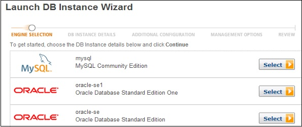
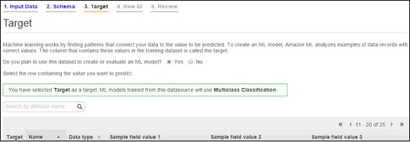
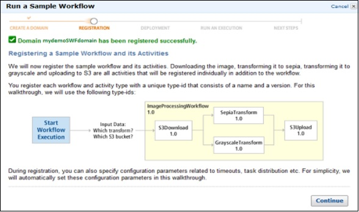

# Deploying Web Apps AWS-Heroku

## Learning Competencies
- Deploying web app on AWS
	- AWS Virtual Private Cloud
	- AWS Route53
	- AWS Storage Services
	- AWS Database Services
	- AWS Analytics Services
	- AWS Application Services
- Deploying your app on Heroku

## Overview

**Amazon Virtual Private Cloud (VPC)** is a commercial cloud computing service that provides users a virtual private cloud, by provisioning a logically isolated section of Amazon Web Services Cloud.

It allows the users to use AWS resources in a virtual network. The users can customize their virtual networking environment as they like, such as selecting own IP address range, creating subnets, and configuring route tables and network gateways.

The list of AWS services that can be used with Amazon VPC are −

- Amazon EC2
- Amazon Route 53
- Amazon WorkSpaces
- Auto Scaling
- Elastic Load Balancing
- AWS Data Pipeline
- Elastic Beanstalk
- Amazon Elastic Cache
- Amazon EMR
- Amazon OpsWorks
- Amazon RDS
- Amazon Redshift

### How to Use Amazon VPC?
Following are the steps to create VPC.

#### Create VPC
**Step 1 −** Open the Amazon VPC console by using the following link − https://console.aws.amazon.com/vpc/

**Step 2 −** Select creating the VPC option on the right side of the navigation bar. Make sure that the same region is selected as for other services.

**Step 3 −** Click the start VPC wizard option, then click VPC with single public subnet option on the left side.


**Step 4 −** A configuration page will open. Fill in the details like VPC name, subnet name and leave the other fields as default. Click the Create VPC button.


**Step 5 −** A dialog box will open, showing the work in progress. When it is completed, select the OK button.

The Your VPCs page opens which shows a list of available VPCs. The setting of VPC can be changed here.


#### Select/Create VPC Group

**Step 1 −** Open the Amazon VPC console by using the following link − https://console.aws.amazon.com/vpc/

**Step 2 −** Select the security groups option in the navigation bar, then choose create security group option.

**Step 3 −** A form will open, enter the details like group name, name tag, etc. Select ID of your VPC from VPC menu, then select the Yes, create button.


**Step 4 −** The list of groups opens. Select the group name from the list and set rules. Then click the Save button.


#### Launch Instance into VPC

**Step 1 −** Open the Amazon VPC console using the following link − https://console.aws.amazon.com/vpc/

**Step 2 −** Select the same region as while creating VPC and security group.

**Step 3 −** Now select the Launch Instance option in the navigation bar.

**Step 4 −** A page opens. Choose the AMI which is to be used.

**Step 5 −** A new page opens. Choose an Instance Type and select the hardware configuration. Then select **Next: Configure Instance Details**.


**Step 6 −** Select the recently created VPC from the Network list, and the subnet from the Subnet list. Leave the other settings as default and click Next till the Tag Instance page.

**Step 7 −** On the Tag Instance page, tag the instance with the Name tag. This helps to identify your instance from the list of multiple instances. Click Next: Configure Security Group.

**Step 8 −** On the Configure Security Group page, select the recently created group from the list. Then, select Review and Launch button.

**Step 9 −** On the Review Instance Launch page, check your instance details, then select Launch.

**Step 10 −** A dialog box appears. Choose the option Select an existing key pair or create a new key pair, then click the Launch Instances button.

**Step 11 −** The confirmation page open which shows all the details related to instances.

#### Assign Elastic IP Address to VPC Instances

**Step 1 −** Open the Amazon VPC console using the following link − https://console.aws.amazon.com/vpc/

**Step 2 −** Select Elastic IP’s option in the navigation bar.

**Step 3 −** Select Allocate New Address. Then select Yes, Allocate button.

**Step 4 −** Select your Elastic IP address from the list, then select Actions, and then click the Associate Address button.

**Step 5 −** A dialog box will open. First select the Instance from the Associate with list. Then select your instance from the Instance list. Finally click the Yes, Associate button.


#### Delete a VPC

There are several steps to delete VPC without losing any resources associated with it. Following are the steps to delete a VPC.

**Step 1 −** Open the Amazon VPC console using the following link − https://console.aws.amazon.com/vpc/

**Step 2 −** Select Instances option in the navigation bar.

**Step 3 −** Select the Instance from the list, then select the Actions → Instance State → Terminate button.

**Step 4 −** A new dialog box opens. Expand the Release attached Elastic IPs section, and select the checkbox next to the Elastic IP address. Click the Yes, Terminate button.

**Step 5 −** Again open the Amazon VPC console using the following link − https://console.aws.amazon.com/vpc/

**Step 6 −** Select the VPC from the navigation bar. Then select Actions & finally click the Delete VPC button.

**Step 7 −** A confirmation message appears. Click the Yes, Delete button.


### Features of VPC
- **Many connectivity options −** There are various connectivity options that exist in Amazon VPC.

	- Connect VPC directly to the Internet via public subnets.

	- Connect to the Internet using Network Address Translation via private subnets.

	- Connect securely to your corporate datacenter via encrypted IPsec hardware VPN connection.

	- Connect privately to other VPCs in which we can share resources across multiple virtual networks through AWS account.

	- Connect to Amazon S3 without using an internet gateway and have good control over S3 buckets, its user requests, groups, etc.

	- Combine connection of VPC and datacenter is possible by configuring Amazon VPC route tables to direct all traffic to its destination.

- **Easy to use −** Ease of creating a VPC in very simple steps by selecting network set-ups as per requirement. Click "Start VPC Wizard", then Subnets, IP ranges, route tables, and security groups will be automatically created.

- **Easy to backup data −** Periodically backup data from the datacenter into Amazon EC2 instances by using Amazon EBS volumes.

- **Easy to extend network using Cloud −** Move applications, launch additional web servers and increase storage capacity by connecting it to a VPC.


### What is Amazon Route 53?

Amazon Route 53 is a scalable domain name system (DNS) service intended to give business and developers a reliable way to direct end users to applications. This is accomplished by translating domain names (`www.websitename.com`) into the numeric IP addresses (`123.12.3`), which is how computers connect to each other.

Amazon Route 53 allows developers to manage the IP addresses, referred to as “records”, listed for domain names in the DNS phone book. Amazon Route 53 answers requests, known as “queries”, to translate domain names into their corresponding IP addresses.

Amazon Route 53 connects queries to infrastructure in AWS, like Elastic Load Balancers, and allows developers to map domain names to S3 buckets, EC2 instances and other AWS resources. It can also be used to direct developers to infrastructure outside of AWS.

Amazon Route 53 makes it possible for developers to control global traffic through an assortment of routing types which can be combined with DNS Failover which directs web traffic to a substitute location to prevent site outages, to enable a mixture of fault-tolerant, low latency architectures. These routing types include Latency Based Routing (lets developers direct end users to the AWS region that delivers the lowest latency), Geo DNS (direct end users to a certain endpoint that can be specified based on the end user’s geographic location) and Weighted Round Robin (specifies the frequency, or “weights”, DNS responses are returned to end users).

### How to Configure Amazon Route 53?

Following are the steps to configure Route 53.

**Step 1 −** Open the Amazon Route 53 console using this link − https://console.aws.amazon.com/route53/.

**Step 2 −** Click create hosted zone option on the top left corner of the navigation bar.


**Step 3 −** A form page opens. Provide the required details such as domain name and comments, then click the Create button.


**Step 4 −** Hosted zone for the domain will be created. There will be four DNS endpoints called delegation set and these endpoints must be updated in the domain names Nameserver settings.


**Step 5 −** If it is godaddy.com then select domain’s control panel and update the Route 53 DNS endpoints. Delete the rest default values. It will take 2-3 minutes to update.

**Step 6 −** Go back to Route 53 console and select the go to record sets option. This will show you the list of record sets. By default, there are two record sets of type NS & SOA.


**Step 7 −** To create your record set, select the create record set option. Fill the required details such as: Name, Type, Alias, TTL seconds, Value, Routing policy, etc. Click the Save record set button.

**Step 8 −** Create one more record set for some other region so that there are two record sets with the same domain name pointing to different IP addresses with your selected routing policy.

Once completed, the user requests will be routed based on the network policy.

### Features of Route 53

- Easy to register your domain − We can purchase all level of domains like .com, .net, .org, etc. directly from Route 53.

- **Highly reliable −** Route 53 is built using AWS infrastructure. Its distributed nature towards DNS servers help to ensure a consistent ability to route applications of end users.

- **Scalable −** Route 53 is designed in such a way that it automatically handles large volume queries without the user’s interaction.

- **Can be used with other AWS Services −** Route 53 also works with other AWS services. It can be used to map domain names to our Amazon EC2 instances, Amazon S3 buckets, Amazon and other AWS resources.

- **Easy to use −** It is easy to sign-up, easy to configure DNS settings, and provides quick response to DNS queries.

- Health Check: Route 53 monitors the health of the application. If an outage is detected, then it automatically redirects the users to a healthy resource.

- **Cost-Effective −** Pay only for the domain service and the number of queries that the service answers for each domain.

- **Secure −** By integrating Route 53 with AWS (IAM), there is complete control over every user within the AWS account, such as deciding which user can access which part of Route 53.


### Technical Content(AWS Amazon S3)

 The need for storage is increasing every day, so building and maintaining your own repositories, therefore, becomes a tedious and tiresome job because knowing the amount of capacity you may need in the future is difficult to predict. You may either over-utilize it leading to an application failure because of not having sufficient space or you may end up buying stacks of storage which will then be under-utilized.

Keeping all these hassles in mind, Amazon came up with an internet storage service called AWS S3.

### What is Amazon S3?

Amazon Simple Storage Service, also known as Amazon S3 is an online storage facility. It is cheap, fast and easy to setup. And since it’s a service provided by e-commerce giant Amazon, you can be rest-assured whatever you stored at S3 is secured. It is designed for large-capacity, low-cost storage provision across multiple geographical regions. Amazon S3 provides developers and IT teams with Secure, Durable and Highly scalable object storage.

S3 is **Secure** because AWS provides:

- Encryption to the data that you store. It can happen in two ways:

	- Client Side Encryption

	- Server Side Encryption

- Multiple copies are maintained to enable regeneration of data in case of data corruption
- **Versioning**, wherein each edit is archived for a potential retrieval.

S3 is Durable because:

- It regularly verifies the integrity of data stored using checksums e.g. if S3 detects there is any corruption in data, it is immediately repaired with the help of replicated data.
- Even while storing or retrieving data, it checks incoming network traffic for any corrupted data packets.

S3 is **Highly Scalable**, since it automatically scales your storage according to your requirement and you only pay for the storage you use.

### Who needs Amazon S3?
In S3, there’s no initial charges, zero setup cost. You only pay for what you utilize. It is utmost suitable for webmasters and bloggers, especially those who have the following issues:

- **Running out of bandwidths**

	- If you are on shared hosting account, any Stumble Upon or Digg effect can easily eat up the entire bandwidth limit for the month. Most of the time, the web host will suspend the account until you have settle the payment for the extra bandwidths consumed. Amazon S3 provides unlimited bandwidth and you’ll be served with any amount of bandwidth your site needs. Charges will be made to credit card and payment can be made at the end of the month.

- **Better scalability**

	- Amazon S3 using cloud hosting and image serving is relatively fast. Separating them away from normal HTTP request will definitely ease the server load and thus, guarantees better stability.

- **Paying for more that you actually used**

	- Whether you are on shared hosting, VPS or dedicated server, you pay a lump sum each month (or year) and the amount includes hard disk storage and bandwidth you might not fully make use of. Why pay for more when you can pay only for what you are used.

- Store files online

	- Instead of backing up your files in CD/DVDs to save more hard disk space, here’s another option. Store them online, and you have the option to keep them private or make them public accessible. It’s entire up to you.

### How to Configure S3?

Following are the steps to configure a S3 account.

**Step 1 −** Open the Amazon S3 console using this link − https://console.aws.amazon.com/s3/home

**Step 2 −** Create a Bucket using the following steps.

- A prompt window will open. Click the Create Bucket button at the bottom of the page.

	

	- Create a Bucket dialog box will open. Fill the required details and click the Create button.

	

	- The bucket is created successfully in Amazon S3. The console displays the list of buckets and its properties.

	

	- Select the Static Website Hosting option. Click the radio button Enable website hosting and fill the required details.

	

**Step 3 −** Add an Object to a bucket using the following steps.

- Open the Amazon S3 console using the following link − https://console.aws.amazon.com/s3/home

- Click the Upload button.

	

	- Click the Add files option. Select those files which are to be uploaded from the system and then click the Open button.

	

	- Click the start upload button. The files will get uploaded into the bucket.

**To open/download an object −** In the Amazon S3 console, in the Objects & Folders list, right-click on the object to be opened/downloaded. Then, select the required object.


### How to Move S3 Objects?

Following are the steps to move S3 objects.

**Step 1 −** Open Amazon S3 console.

**Step 2 −** Select the files & folders option in the panel. Right-click on the object that is to be moved and click the Cut option.


**Step 3 −** Open the location where we want this object. Right-click on the folder/bucket where the object is to be moved and click the Paste into option.


### How to Delete an Object?

**Step 1 −** Open Amazon S3.

**Step 2 −** Select the files & folders option in the panel. Right-click on the object that is to be deleted. Select the delete option.

**Step 3 −** A pop-up window will open for confirmation. Click Ok.


### How to Empty a Bucket?

**Step 1 −** Open Amazon S3 console.

**Step 2 −** Right-click on the bucket that is to be emptied and click the empty bucket option.


**Step 3 −** A confirmation message will appear on the pop-up window. Read it carefully and click the **Empty bucket** button to confirm.


### Features of Amazon S3

- **Low cost and Easy to Use −** Using Amazon S3, the user can store a large amount of data at very low charges.

- **Secure −** Amazon S3 supports data transfer over SSL and the data gets encrypted automatically once it is uploaded. The user has complete control over their data by configuring bucket policies using AWS IAM.

- **Scalable −** Using Amazon S3, there need not be any worry about storage concerns. We can store as much data as we have and access it anytime.

- **Higher performance −** Amazon S3 is integrated with Amazon CloudFront, that distributes content to the end users with low latency and provides high data transfer speeds without any minimum usage commitments.

- **Integrated with AWS services −** Amazon S3 integrated with AWS services include Amazon CloudFront, Amazon CLoudWatch, Amazon Kinesis, Amazon RDS, Amazon Route 53, Amazon VPC, AWS Lambda, Amazon EBS, Amazon Dynamo DB, etc.

****************************************************************

### Technial Content(Amazon Web Services - Storage Services - Elastic Block Store)

**Amazon Elastic Block Store** (EBS) is a block storage system used to store persistent data. Amazon EBS is suitable for EC2 instances by providing highly available block level storage volumes. It has three types of volume, i.e. General Purpose (SSD), Provisioned IOPS (SSD), and Magnetic. These three volume types differ in performance, characteristics, and cost.

### EBS Volume Types

Following are the three types.

#### EBS General Purpose (SSD)

This volume type is suitable for small and medium workloads like Root disk EC2 volumes, small and medium database workloads, frequently logs accessing workloads, etc. By default, SSD supports 3 IOPS (Input Output Operations per Second)/GB means 1 GB volume will give 3 IOPS, and 10 GB volume will give 30 IOPS. Its storage capacity of one volume ranges from 1 GB to 1 TB. The cost of one volume is $0.10 per GB for one month.


#### Provisioned IOPS (SSD)

This volume type is suitable for the most demanding I/O intensive, transactional workloads and large relational, EMR and Hadoop workloads, etc. By default, IOPS SSD supports 30 IOPS/GB means 10GB volume will give 300 IOPS. Its storage capacity of one volume ranges from 10GB to 1TB. The cost of one volume is $0.125 per GB for one month for provisioned storage and $0.10 per provisioned IOPS for one month.

#### EBS Magnetic Volumes

It was formerly known as standard volumes. This volume type is suitable for ideal workloads like infrequently accessing data, i.e. data backups for recovery, logs storage, etc. Its storage capacity of one volume ranges from 10GB to 1TB. The cost of one volume is $0.05 per GB for one month for provisioned storage and $0. 05 per million I/O requests.

#### Volumes Attached to One Instance

Each account will be limited to 20 EBS volumes. For a requirement of more than 20 EBS volumes, contact Amazon’s Support team. We can attach up to 20 volumes on a single instance and each volume ranges from 1GB to 1TB in size.

In EC2 instances, we store data in local storage which is available till the instance is running. However, when we shut down the instance, the data gets lost. Thus, when we need to save anything, it is advised to save it on Amazon EBS, as we can access and read the EBS volumes anytime, once we attach the file to an EC2 instance.

### Advantages of using Amazon EBS

- **Reliable -** EBS volumes have redundancy built in, which means that they will not fail if an individual drive fails or some other single failure occurs.

- **Secure -** Amazon’s flexible access control policies allows to specify who can access which EBS volumes. Access control plus encryption offers a strong defense-in-depth security strategy for data.

- **Higher Performance -** Amazon EBS uses SSD technology to deliver data results with consistent I/O performance of application.

- **Easy Data Backup -** Data backup can be saved by taking point-in-time snapshots of Amazon EBS volumes.

### How to Set Up Amazon EBS?

**Step 1 −** Create Amazon EBS volume using the following steps.

- Open the Amazon EC2 console.

- Select the region in the navigation bar where the volume is to be created.

- In the navigation pane, select Volumes, then select Create Volume.

- Provide the required information like Volume Type list, Size, IOPS, Availability zone, etc. then click the Create button.


The volume names can be seen in the volumes list. 


**Step 2 −** Store EBS Volume from a snapshot using the following steps.

- Repeat the above 1 to 4 steps to create volume.

- Type snapshot ID in the Snapshot ID field from which the volume is to be restored and select it from the list of suggested options.

- If there is requirement for more storage, change the storage size in the Size field.

- Select the Yes Create button.

**Step 3 −** Attach EBS Volume to an Instance using the following steps.

- Open the Amazon EC2 console.

- Select Volumes in the navigation pane. Choose a volume and click the Attach Volume option.


- An Attach Volume dialog box will open. Enter the name/ID of instance to attach the volume in the Instance field or select it from the list of suggestion options.

- Click the Attach button.


- Connect to instance and make the volume available.

**Step 4 −** Detach a volume from Instance.

- First, use the command /dev/sdh in cmd to unmount the device.

- Open the Amazon EC2 console.

- In the navigation pane, select the Volumes option.

- Choose a volume and click the Detach Volumes option.


- A confirmation dialog box opens. Click the Yes, Detach buton to confirm.


### What is AWS Storage Gateway?

AWS Storage Gateway connects an on-premises software appliance with cloud-based storage to provide seamless integration with data security features between your on-premises IT environment and the Amazon Web Services (AWS) storage infrastructure. You can use the service to store data in the AWS Cloud for scalable and cost-effective storage that helps maintain data security. AWS Storage Gateway offers file-based, volume-based and tape-based storage solutions.


### Volume Gateway
This storage type provides cloud-backed storage volumes which can be mount as Internet Small Computer System Interface (iSCSI) devices from on-premises application servers.

#### Gateway-cached Volumes
AWS Storage Gateway stores all the on-premises application data in a storage volume in Amazon S3. Its storage volume ranges from 1GB to 32 TB and up to 20 volumes with a total storage of 150TB. We can attach these volumes with iSCSI devices from on-premises application servers.

#### Cache Storage Disk

Every application requires storage volumes to store their data. This storage type is used to initially store data when it is to be written to the storage volumes in AWS. The data from the cache storage disk is waiting to be uploaded to Amazon S3 from the upload buffer. The cache storage disk keeps the most recently accessed data for low-latency access. When the application needs data, the cache storage disk is first checked before checking Amazon S3.

There are few guidelines to determine the amount of disk space to be allocated for cache storage. We should allocate at least 20% of the existing file store size as cache storage. It should be more than the upload buffer.

**Upload buffer disk −** This type of storage disk is used to store the data before it is uploaded to Amazon S3 over SSL connection. The storage gateway uploads the data from the upload buffer over an SSL connection to AWS.

**Snapshots −** Sometimes we need to back up storage volumes in Amazon S3. These backups are incremental and are known as **snapshots**. The snapshots are stored in Amazon S3 as Amazon EBS snapshots. Incremental backup means that a new snapshot is backing up only the data that has changed since the last snapshot. We can take snapshots either at a scheduled interval or as per the requirement.

#### Gateway-stored Volumes

When the Virtual Machine (VM) is activated, gateway volumes are created and mapped to the on-premises direct-attached storage disks. Hence, when the applications write/read the data from the gateway storage volumes, it reads and writes the data from the mapped on-premises disk.

A gateway-stored volume allows to store primary data locally and provides on-premises applications with low-latency access to entire datasets. We can mount them as iSCSI devices to the on-premises application servers. It ranges from 1 GB to 16 TB in size and supports up to 12 volumes per gateway with a maximum storage of 192 TB.

### Gateway-Virtual Tape Library (VTL)

This storage type provides a virtual tape infrastructure that scales seamlessly with your business needs and eliminates the operational burden of provisioning, scaling, and maintaining a physical tape infrastructure. Each gateway-VTL is preconfigured with media changer and tape drives, that are available with the existing client backup applications as iSCSI devices. Tape cartridges can be added later as required to archive the data.

Few terms used in Architecture are listed below.

- Virtual Tape 

- Tape Drive 

- Media Changer 

- Virtual Tape Shelf (VTS) 

- Archiving Tapes 

- Retrieving Tapes 

### Technical Content(Amazon Web Services - Storage Services - CloudFront)

**Amazon CloudFront** is a *content delivery network (CDN)* offered by Amazon Web Services. Content delivery networks provide a globally-distributed network of proxy servers which cache content, such as web videos or other bulky media, more locally to consumers, thus improving access speed for downloading the content.

CloudFront retrieves data from Amazon S3 bucket and distributes it to multiple datacenter locations. It delivers the data through a network of data centers called **edge locations**. The nearest edge location is routed when the user requests for data, resulting in lowest latency, low network traffic, fast access to data, etc.

### How AWS CloudFront Delivers the Content?

AWS CloudFront delivers the content in the following steps.

**Step 1 −** The user accesses a website and requests an object to download like an image file.

**Step 2 −** DNS routes your request to the nearest CloudFront edge location to serve the user request.

**Step 3 −** At edge location, CloudFront checks its cache for the requested files. If found, then returns it to the user otherwise does the following −

- First CloudFront compares the request with the specifications and forwards it to the applicable origin server for the corresponding file type.

- The origin servers send the files back to the CloudFront edge location.

- As soon as the first byte arrives from the origin, CloudFront starts forwarding it to the user and adds the files to the cache in the edge location for the next time when someone again requests for the same file.

**Step 4 −** The object is now in an edge cache for 24 hours or for the provided duration in file headers. CloudFront does the following −

- CloudFront forwards the next request for the object to the user’s origin to check the edge location version is updated or not.

- If the edge location version is updated, then CloudFront delivers it to the user.

- If the edge location version is not updated, then origin sends the latest version to CloudFront. CloudFront delivers the object to the user and stores the latest version in the cache at that edge location.

### Setting Up AWS CloudFront

AWS CloudFront can be set up using the following steps.

**Step 1 −** Sign in to AWS management console using the following link − https://console.aws.amazon.com/

**Step 2 −** Upload Amazon S3 and choose every permission public. (How to upload content to S3 bucket is discussed in chapter 14)

**Step 3 −** Create a CloudFront Web Distribution using the following steps.

- Open CloudFront console using the following link − https://console.aws.amazon.com/cloudfront/

- Click the Get Started button in the web section of Select a delivery method for your content page.


- **Create Distribution** page opens. Choose the Amazon S3 bucket created in the Origin Domain Name and leave the remaining fields as default.


- Default Cache Behavior Settings page opens. Keep the values as default and move to the next page.

- A Distribution settings page opens. Fill the details as per your requirement and click the Create Distribution button.

- The Status column changes from In Progress to Deployed. Enable your distribution by selecting the Enable option. It will take around 15 minutes for the domain name to be available in the Distributions list.

### Test the Links

After creating distribution, CloudFront knows the location of Amazon S3 server and the user knows the domain name associated with the distribution. However, we can also create a link to Amazon S3 bucket content with that domain name and have CloudFront serve it. This helps save a lot of time.

Following are the steps to link an object −

**Step 1 −** Copy the following HTML code to a new file and write the domain-name that CloudFront assigned to the distribution in the place of domain name. Write a file name of Amazon S3 bucket in the place of object-name.
```html
<html> 
   <head>CloudFront Testing link</head> 
   <body> 
      <p>My Cloudfront.</p> 
      <p> 
   </body> 
</html>
```
**Step 2 −** Save the text in a file with .html extension.

**Step 3 −** Open the web page in a browser to test the links to see if they are working correctly. If not, then crosscheck the settings.

```
CloudFront has servers located in **Europe** (*United Kingdom, Ireland, The Netherlands, Germany, Spain*), **Asia** (*Hong Kong, Singapore, Japan, Taiwan* and *India*), **Australia**, **South America**, as well as in several major cities in the *United States*. The service operates from 69 edge locations on five continents.
```

************************


### Technical Content(AWS - Database Services - Relational Database Service(RDS))

**Amazon Relational Database Service** (or **Amazon RDS**) is a distributed relational database service by Amazon Web Services (AWS). It is a web service running in the cloud designed to simplify the setup, operation, and scaling of a relational database for use in applications. Complex administration processes like patching the database software, backing up databases and enabling point-in-time recovery are managed automatically. Scaling storage and compute resources can be performed by a single API call.

It is a fully-managed SQL database cloud service that allows to create and operate relational databases. Using RDS you can access your files and database anywhere in a cost-effective and highly scalable way.

### Features of Amazon RDS

Amazon Relational Database Service has the following specialities:

- **Cost effective** :*Using Amazon RDS, we pay only for the resources we consume. There is no up-front and long-term commitment.*

- **Scalable** :*Amazon RDS allows to scale the relational database by using AWS Management Console or RDS-specific API. We can increase or decrease your RDS requirements within minutes.*

- **Host replacement** :*Sometimes these situations occur when the hardware of Amazon RDS fails. There is no need to worry, it will be automatically replaced by Amazon.*

- **Automated Backups** :*Amazon RDS backs up everything in the database including transaction logs up to last five minutes and also manages automatic backup timings.*

- **Secure** :*Amazon RDS provides complete control over the network to access their database and their associated services.*

- **Software Patching** :*Automatically gets all the latest patches for the database software. We can also specify when the software should be patched using DB Engine Version Management.*

### How to Set Up AWS RDS?

**Step 1 −** Login to AWS management console. Use the following link to open Amazon RDS console − https://console.aws.amazon.com/rds/

**Step 2 −** Select the region where the DB instance is to be created, at the top right corner of the Amazon RDS console.

**Step 3 −** Select Instances in the navigation pane, then click Launch DB Instance button.

**Step 4 −** The Launch DB Instance Wizard opens. Select the type of instance as required to launch and click the Select button.



**Step 5 −** On the Specify DB Details page, provide the required details and click the Continue button.


**Step 6 −** On the Additional configuration page, provide the additional information required to launch the MySQL DB instance and click the Continue button.


**Step 7 −** On Management options page, make the choices and click the Continue button.


**Step 8 −** On the Review page, verify the details and click the Launch DB Instance button.


Now DB instance shows in the list of DB instances.

### How to Connect Database to MySQL DB Instance?

Following are the steps to connect a database on MySQL DB instance −

**Step 1 −** Type the following command in the command prompt on a client computer to connect a database on MySQL DB instance (using the MySQL monitor).

**Step 2 −** Replace <myDBI> with DNS name of your DB instance, <myusername> with your master user-name & <mypassword> with your master password.
```
PROMPT> mysql -h <myDBI> -P 3306 -u <myusername> -p
```
After running the above command, the output looks like −
```
Welcome to the MySQL monitor.  Commands end with ; or \g. 
Your MySQL connection id is 350 
Server version: 5.2.33-log MySQL Community Server (GPL)
Type 'help;' or '\h' for help. Type '\c' to clear the buffer.  
mysql>
```

### How to Delete a DB Instance?

After completing the task, we should delete the DB instance so will not be charged for it. Follow these steps to delete a DB instance −

**Step 1 −** Sign in to the AWS Management Console and use the following link to open the Amazon RDS console.

https://console.aws.amazon.com/rds/

**Step 2 −** In the DB Instances list, select the DB instances to be deleted.

**Step 3 −** Click the Instance Actions button and then select the Delete option from the dropdown menu.

**Step 4 −** Select No in the Create Final Snapshot.

**Step 5 −** Click the Yes, Delete to delete the DB instance.

### Cost of AWS RDS

When using Amazon RDS, pay only for only the usage without any minimum and setup charges. Billing is based on the following criteria −

- **Instance class** :*Pricing is based on the class of the DB instance consumed.*

- **Running time** :*Price is calculated by the instance-hour, which is equivalent to a single instance running per hour.*

- **Storage** :*Bill is calculated as per the storage capacity plan chosen in terms of per GB.*

- **I/O requests per month** :*Billing structure also includes total number of storage I/O requests made in a billing cycle.*

- **Backup storage** :*There is no additional charges for backup storage up to 100% of database. This service is free only for active DB instances.*

(**Note** - We will do *Relational Database* further in great detail)


************************************************************************

### Technical Content(AWS - Relational Database - DynamoDB)

**Amazon DynamoDB** is a fully managed NoSQL database service that allows to create database tables that can store and retrieve any amount of data. It automatically manages the data traffic of tables over multiple servers and maintains performance. It also relieves the customers from the burden of operating and scaling a distributed database. Hence, hardware provisioning, setup, configuration, replication, software patching, cluster scaling, etc. is managed by Amazon.

### How to Run DynamoDB on Computer?

Following are the steps to set up DynamoDB.

**Step 1 −** Following are the steps to set up DynamoDB.

- Download DynamoDB (.jar file) using the following link. It supports multiple Operating Systems like Windows, Linux, Mac, etc.

- **.tar.gz format −** Download [here](http://dynamodb-local.s3-website-us-west2.amazonaws.com/dynamodb_local_latest.tar.gz)

- **.zip format −** Download [here](http://dynamodb-local.s3-website-us-west2.amazonaws.com/dynamodb_local_latest.zip)

- Once download is complete, extract the contents and copy the extracted directory to a location wherever you want.

- Open the command prompt and navigate to the directory where you extracted DynamoDBLocal.jar, and execute the following command:

```
java -Djava.library.path=./DynamoDBLocal_lib -jar DynamoDBLocal.jar -sharedDb 
```

- Now there is access to the build-in JS shell.

**Step 2 −** Create a Table using the following steps.

- Open AWS Management Console and select DynamoDB.

- Select the region where the table will be created and click the Create Table button.

	

- Create Table window opens. Fill the details into their respective fields and click the Continue button.

- Finally, a review page opens where we can view details. Click the Create button.

	

- Now the Table-name is visible in the in-to the list and Dynamo Table is ready to use.

	


We can also create a table in DynamoDB using AWS Java SDK - 

Let's create a simple Student Table which will have 4 fields: “stdId”, “stdName”, “subject” and “marks” where “stdId” is the hash key.

Every table in DynamoDB has a hash key, which is a primary key for the table. Records can be looked up using the hash key very efficiently. For our student table, the student id – stdid will be the hash key. Given that DynamoDB can store data in multiple servers, records will be distributed across servers based on the hash key.

```js
CreateTableRequest createTableRequest = new CreateTableRequest()
  .withTableName("StudentTable")
  .withKeySchema(new KeySchemaElement().withAttributeName("stdId").withKeyType(KeyType.HASH),
                 new KeySchemaElement().withAttributeName("stdName").withKeyType(KeyType.RANGE))
  .withAttributeDefinitions(new AttributeDefinition().withAttributeName("stdId").withAttributeType("N"),
                            new AttributeDefinition().withAttributeName("stdName").withAttributeType("S"))
  .withProvisionedThroughput(new ProvisionedThroughput().withReadCapacityUnits(10L).withWriteCapacityUnits(10L));

  CreateTableResult result = dbClient.createTable(createTableRequest);

  waitForTableToBecomeAvailable("StudentTable");
  ```

While creating the table, we have to declare these properties –

- Provisioned throughout for the table – read write performance desired from the table in terms of reads and writes per second

- We also have to add column definition for each of the columns, while specifying their type, and if any column will be a hash key. For example the **stdId** column has numeric type, and it will be a hash key.

The method **waitForTableToBecomeAvailable** polls our database in a loop until the table we created becomes available. We can check for table status using the Describe table API in DynamoDB.

#### Creating a DynamoDB Client

Note that before creating the table, we have to first create a client for DynamoDB. This client needs to be supplied information such as our AWS access key and secret key. Typically these can be passed through a properties file. Following code shows how to create a client.

```js
dbClient = new AmazonDynamoDBClient(new ClasspathPropertiesFileCredentialsProvider());
```

#### Inserting Records

Let's try to insert some data in the table - 
```js
void populateStudent(int stdId, String stdName, String subject, int marks) {

Map item = new HashMap();
  item.put("stdId", new AttributeValue().withN(Integer.toString(stdId)));
  item.put("stdName", new AttributeValue(stdName));
  item.put("subject", new AttributeValue(subject));
  item.put("marks", new AttributeValue().withN(Integer.toString(marks)));

 PutItemRequest putItemRequest = new PutItemRequest(“StudentTable”, item);
 PutItemResult putItemResult = dbClient.putItem(putItemRequest);

}
```
The above method creates a DynamoDB item (row) which is basically just a map of column name to its AttributeValue.
An item can be stored into the table using a PutItemRequest.

### Benefits of Amazon DynamoDB

- **Managed service** :*Amazon DynamoDB is a managed service. There is no need to hire experts to manage NoSQL installation. Developers need not worry about setting up, configuring a distributed database cluster, managing ongoing cluster operations, etc. It handles all the complexities of scaling, partitions and re-partitions data over more machine resources to meet I/O performance requirements.*

- **Scalable** :*Amazon DynamoDB is designed to scale. There is no need to worry about predefined limits to the amount of data each table can store. Any amount of data can be stored and retrieved. DynamoDB will spread automatically with the amount of data stored as the table grows.*

- **Fast** :*Amazon DynamoDB provides high throughput at very low latency. As datasets grow, latencies remain stable due to the distributed nature of DynamoDB's data placement and request routing algorithms.*

- **Durable and highly available** :*Amazon DynamoDB replicates data over at least 3 different data centers’ results. The system operates and serves data even under various failure conditions.*

- **Flexible** :*Amazon DynamoDB allows creation of dynamic tables, i.e. the table can have any number of attributes, including multi-valued attributes.*

- **Cost-effective** :*Payment is for what we use without any minimum charges. Its pricing structure is simple and easy to calculate.*


************************************************************

### Technical Content(AWS - Database Services - Redshift)

**Amazon Redshift** is a fully managed data warehouse service in the cloud. Its datasets range from 100s of gigabytes to a petabyte. The initial process to create a data warehouse is to launch a set of compute resources called **nodes**, which are organized into groups called **cluster**. After that you can process your queries.

### How to Set Up Amazon Redshift?

Following are the steps to set up Amazon Redshift.

**Step 1 −** Sign in and launch a Redshift Cluster using the following steps.

- Sign in to AWS Management console and use the following link to open Amazon Redshift console − https://console.aws.amazon.com/redshift/

- Select the region where the cluster is to be created using the Region menu on the top right side corner of the screen.

- Click the Launch Cluster button.

- The Cluster Details page opens. Provide the required details and click the Continue button till the review page.


- A confirmation page opens. Click the Close button to finish so that cluster is visible in the Clusters list.


Select the cluster in the list and review the Cluster Status information. The page will show Cluster status.


**Step 2 −** Configure security group to authorize client connections to the cluster. The authorizing access to Redshift depends on whether the client authorizes an EC2 instance or not.

Follow these steps to security group on EC2-VPC platform.

- Open Amazon Redshift Console and click Clusters on the navigation pane.

- Select the desired Cluster. Its Configuration tab opens.


- Click the Security group.

- Once the Security group page opens, click the Inbound tab.


- Click the Edit button. Set the fields as shown below and click the Save button.

 - Type − Custom TCP Rule.

 - Protocol − TCP.

 - Port Range − Type the same port number used while launching the cluster. By-default port for Amazon Redshift is 5439.

 - Source − Select Custom IP, then type 0.0.0.0/0.


**Step 3 −** Connect to Redshift Cluster.

There are two ways to connect to Redshift Cluster − Directly or via SSL.

Following are the steps to connect directly.

- Connect the cluster by using a SQL client tool. It supports SQL client tools that are compatible with PostgreSQL JDBC or ODBC drivers.

 Use the following links to download − **[JDBC](https://jdbc.postgresql.org/download/postgresql-8.4-703.jdbc4.jar)**, **[ODBC](https://ftp.postgresql.org/pub/odbc/versions/msi/psqlodbc_08_04_0200.zip)** or **[ODBC for 64 bit machines](http://ftp.postgresql.org/pub/odbc/versions/msi/psqlodbc_09_00_0101x64.zip)**

- Use the following steps to get the Connection String.

 - Open Amazon Redshift Console and select Cluster in the Navigation pane.

 - Select the cluster of choice and click the Configuration tab.

 - A page opens as shown in the following screenshot with JDBC URL under Cluster Database Properties. Copy the URL.


- Use the following steps to connect the Cluster with SQL Workbench/J.

 - Open SQL Workbench/J.

 - Select the File and click the Connect window.

 - Select Create a new connection profile and fill the required details like name, etc.

 - Click Manage Drivers and Manage Drivers dialog box opens.

 - Click the Create a new entry button and fill the required details.


 - Click the folder icon and navigate to the driver location. Finally, click the Open button.


 - Leave the Classname box and Sample URL box blank. Click OK.

 - Choose the Driver from the list.

 - In the URL field, paste the JDBC URL copied.

 - Enter the username and password to their respective fields.

 - Select the Autocommit box and click Save profile list.


### Features of Amazon Redshift

Following are the features of Amazon Redshift −

- **Supports VPC −** *The users can launch Redshift within VPC and control access to the cluster through the virtual networking environment.*

- **Encryption −** *Data stored in Redshift can be encrypted and configured while creating tables in Redshift.*

- **SSL −** *SSL encryption is used to encrypt connections between clients and Redshift.*

- **Scalable −** *With a few simple clicks, the number of nodes can be easily scaled in your Redshift data warehouse as per requirement. It also allows to scale over storage capacity without any loss in performance.*

- **Cost-effective −** *Amazon Redshift is a cost-effective alternative to traditional data warehousing practices. There are no up-front costs, no long-term commitments and on-demand pricing structure.*

### Technical Content(AWS - Analytics Services - Kinesis)

**Amazon Kinesis** is a managed, scalable, cloud-based service that allows real-time processing of streaming large amount of data per second. It is designed for real-time applications and allows developers to take in any amount of data from several sources, scaling up and down that can be run on EC2 instances.

It is used to capture, store, and process data from large, distributed streams such as event logs and social media feeds. After processing the data, Kinesis distributes it to multiple consumers simultaneously.

### How to Use Amazon KCL?

It is used in situations where we require rapidly moving data and its continuous processing. Amazon Kinesis can be used in the following situations −

- **Data log and data feed intake −** *We need not wait to batch up the data, we can push data to an Amazon Kinesis stream as soon as the data is produced. It also protects data loss in case of data producer fails. For example: System and application logs can be continuously added to a stream and can be available in seconds when required.*

- **Real-time graphs −** *We can extract graphs/metrics using Amazon Kinesis stream to create report results. We need not wait for data batches.*

- **Real-time data analytics −** *We can run real-time streaming data analytics by using Amazon Kinesis.*

### Limits of Amazon Kinesis

Following are certain limits that should be kept in mind while using Amazon Kinesis Streams:

- Records of a stream can be accessible up to 24 hours by default and can be extended up to 7 days by enabling extended data retention.

- The maximum size of a data blob (the data payload before Base64-encoding) in one record is 1 megabyte (MB).

- One shard supports up to 1000 PUT records per second.

- For more information related to limits, visit the following link − https://docs.aws.amazon.com/kinesis/latest/dev/service-sizes-and-limits.html

### How to Use Amazon Kinesis?

**Step 1 −** Set up Kinesis Stream using the following steps −

- Sign into AWS account. Select Amazon Kinesis from Amazon Management Console.

- Click the Create stream and fill the required fields such as stream name and number of shards. Click the Create button.


- The Stream will now be visible in the Stream List.

**Step 2 −** Set up users on Kinesis stream. Create New Users & assign a policy to each user.(We have discussed the procedure above to create Users and assigning policy to them)

**Step 3 −** Connect your application to Amazon Kinesis; here we are connecting Zoomdata to Amazon Kinesis. Following are the steps to connect.

- Log in to Zoomdata as Administrator and click Sources in menu.


- Select a Kinesis icon and fill the required details. Click the Next button.


- Select the desired Stream on the Stream tab.

- On the Fields tab, create unique label names, as required and click the Next button.

- On the Charts Tab, enable the charts for data. Customize the settings as required and then click the Finish button to save the setting.

### Features of Amazon Kinesis

- **Real-time processing −** It allows to collect and analyze information in real-time like stock trade prices otherwise we need to wait for data-out report.

- **Easy to use −** Using Amazon Kinesis, we can create a new stream, set its requirements, and start streaming data quickly.

- **High throughput, elastic −** It allows to collect and analyze information in real-time like stock trade prices otherwise we need to wait for data-out report.

- **Integrate with other Amazon services −** It can be integrated with Amazon Redshift, Amazon S3 and Amazon DynamoDB.

- **Build kinesis applications −** Amazon Kinesis provides the developers with client libraries that enable the design and operation of real-time data processing applications. Add the Amazon Kinesis Client Library to Java application and it will notify when new data is available for processing.

- **Cost-efficient −** Amazon Kinesis is cost-efficient for workloads of any scale. Pay as we go for the resources used and pay hourly for the throughput required.


### Technical Content(AWS - Analytics Services - Elastic MapReduce)

**Amazon Elastic MapReduce (EMR)** is a web service that provides a managed framework to run data processing frameworks such as Apache Hadoop, Apache Spark, and Presto in an easy, cost-effective, and secure manner.

It is used for data analysis, web indexing, data warehousing, financial analysis, scientific simulation, etc.

### How to Set Up Amazon EMR?

Follow these steps to set up Amazon EMR −

**Step 1 −** Sign in to AWS account and select Amazon EMR on management console.

**Step 2 −** Create Amazon S3 bucket for cluster logs & output data. (Procedure is explained in detail in Amazon S3 section)

**Step 3 −** Launch Amazon EMR cluster.

Following are the steps to create cluster and launch it to EMR.

- Use this link to open Amazon EMR console − https://console.aws.amazon.com/elasticmapreduce/home

- Select create cluster and provide the required details on Cluster Configuration page.


- Leave the Tags section options as default and proceed.

- On the Software configuration section, level the options as default.


On the File System Configuration section, leave the options for EMRFS as set by default. EMRFS is an implementation of HDFS, it allows Amazon EMR clusters to store data on Amazon S3.


- On the Hardware Configuration section, select m3.xlarge in EC2 instance type field and leave other settings as default. Click the Next button.


- On the Security and Access section, for EC2 key pair, select the pair from the list in EC2 key pair field and leave the other settings as default.

- On Bootstrap Actions section, leave the fields as set by default and click the Add button. Bootstrap actions are scripts that are executed during the setup before Hadoop starts on every cluster node.

- On the Steps section, leave the settings as default and proceed.

- Click the Create Cluster button and the Cluster Details page opens. This is where we should run the Hive script as a cluster step and use the Hue web interface to query the data.

**Step 4 −** Run the Hive script using the following steps.

- Open the Amazon EMR console and select the desired cluster.

- Move to the Steps section and expand it. Then click the Add step button.

- The Add Step dialog box opens. Fill the required fields, then click the Add button.


- To view the output of Hive script, use the following steps −

  - Open the Amazon S3 console and select S3 bucket used for the output data.

  - Select the output folder.

  - The query writes the results into a separate folder. Select os_requests.

  - The output is stored in a text file. This file can be downloaded.


### Benefits of Amazon EMR

Following are the benefits of Amazon EMR −

- **Easy to use −** *Amazon EMR is easy to use, i.e. it is easy to set up cluster, Hadoop configuration, node provisioning, etc.*

- **Reliable −** *It is reliable in the sense that it retries failed tasks and automatically replaces poorly performing instances.*

- **Elastic −** *Amazon EMR allows to compute large amount of instances to process data at any scale. It easily increases or decreases the number of instances.*

- **Secure −** *It automatically configures Amazon EC2 firewall settings, controls network access to instances, launch clusters in an Amazon VPC, etc.*

- **Flexible −** *It allows complete control over the clusters and root access to every instance. It also allows installation of additional applications and customizes your cluster as per requirement.*

- **Cost-efficient −** *Its pricing is easy to estimate. It charges hourly for every instance used.*

### Technical Content(AWS - Analytics Services - Data Pipeline)

The **AWS Data Pipeline** is “a web service that you can use to automate the movement and transformation of data.” In essence you do three things:

1. Define data nodes:
2. Schedule compute activities
3. Activate & monitor your set up

Let's define few terms:

- **Data Nodes** :* AWS Data Pipeline (AWS DP) works with with data stored in S3, DynamoDB, Redshift, RDS, and JDBC sources (relational databases sitting on EC2 instances)*

- **Compute Activities** :*Compute activities are the work that's performed on the data. You can use one or more of the ones Amazon has built-in, or create your own custom ones. A few of the built-in ones are:
    - CopyActivity: as it sounds, it copies data from one location to another
    - HiveActivity: runs a Hive query on an Amazon EMR cluster
    - ShellCommandActivity: runs a custom UNIX/Linux shell command*

- **Activation & Monitoring** :*Once you activate your pipeline it's pretty hands-off until something goes wrong. When that happens, whether it's because of a dependency failure or user cancellation, you'll get an alert so you can handle it.*

*A simple example for archiving and analyzing web logs looks like this:*


Every day at a scheduled time, an activity copies log files from a web server running on an Amazon EC2 instance to S3. On a weekly basis, another activity kicks off and performs an analysis of the log files using Amazon EMR(Elastic MapReduce).

### How to Set Up Data Pipeline?

Following are the steps to set up data pipeline −

**Step 1 −** Create the Pipeline using the following steps.

- Sign-in to AWS account.

- Use this link to Open AWS Data Pipeline console − https://console.aws.amazon.com/datapipeline/

- Select the region in the navigation bar.

- Click the Create New Pipeline button.

- Fill the required details in the respective fields.

	- In the Source field, choose Build using a template and then select this template − Getting Started using ShellCommandActivity.

	

	- The Parameters section opens only when the template is selected. Leave the S3 input folder and Shell command to run with their default values. Click the folder icon next to S3 output folder, and select the buckets.
	- In Schedule, leave the values as default.

	- In Pipeline Configuration, leave the logging as enabled. Click the folder icon under S3 location for logs and select the buckets.

	- In Security/Access, leave IAM roles values as default.

	- Click the Activate button.

### How to Delete a Pipeline?

Deleting the pipeline will also delete all associated objects.

**Step 1 −** Select the pipeline from the pipelines list.

**Step 2 −** Click the Actions button and then choose Delete.


**Step 3 −** A confirmation prompt window opens. Click Delete.

### Features of AWS Data Pipeline

- **Simple and cost-efficient −** Its drag-and-drop features makes it easy to create a pipeline on console. Its visual pipeline creator provides a library of pipeline templates. These templates make it easier to create pipelines for tasks like processing log files, archiving data to Amazon S3, etc.

- **Reliable −** Its infrastructure is designed for fault tolerant execution activities. If failures occur in the activity logic or data sources, then AWS Data Pipeline automatically retries the activity. If the failure continues, then it will send a failure notification. We can even configure these notification alerts for situations like successful runs, failure, delays in activities, etc.

- **Flexible −** AWS Data Pipeline provides various features like scheduling, tracking, error handling, etc. It can be configured to take actions like run Amazon EMR jobs, execute SQL queries directly against databases, execute custom applications running on Amazon EC2, etc.


## Technical Content(Amazon Machine Learning)

**Amazon Machine Learning** is a service that allows to develop predictive applications by using algorithms, mathematical models based on the user’s data.

Amazon Machine Learning reads data through Amazon S3, Redshift and RDS, then visualizes the data through the AWS Management Console and the Amazon Machine Learning API. This data can be imported or exported to other AWS services via S3 buckets.

It uses “industry-standard logistic regression” algorithm to generate models.

### Types of Tasks Performed by Amazon Machine Learning

Three different types of tasks can be performed by Amazon Machine learning service −

- A binary classification model can predict one of the two possible results, i.e. either yes or no.

- A multi-class classification model can predict multiple conditions. For example, it can track a customer's online orders.

- A regression model results in an exact value. Regression models can predict the best-selling price for a product or the number of units that will sell.

### How to Use Amazon Machine Learning?

**Step 1 −** Sign in to AWS account and select Machine Learning. Click the Get Started button.


**Step 2 −** Select Standard Setup and then click Launch.


**Step 3 −** In the Input data section, fill the required details and select the choice for data storage, either S3 or Redshift. Click the Verify button.


**Step 4 −** After S3 location verification is completed, Schema section opens. Fill the fields as per requirement and proceed to the next step.


**Step 5 −** In Target section, reselect the variables selected in Schema section and proceed to the next step.




**Step 6 −** Leave the values as default in Row ID section and proceed to the Review section. Verify the details and click the Continue button.

Following are some screenshots of Machine Learning services.

#### Data Set Created by Machine Learning


#### Summary Made by Machine Learning


#### Exploring Performance Using Machine Learning


### Features of Amazon Machine Learning

- **Easy to create machine learning models −** It is easy to create ML models from data stored in Amazon S3, Amazon Redshift, Amazon RDS and query these models for predictions by using Amazon ML APIs and wizards.

- **High performance −** Amazon ML prediction APIs can be used further to generate billions of predictions for the applications. We can use them within interactive web, mobile, or desktop applications.

- **Cost-efficient −** Pay only for what we use without any setup charges and no upfront commitments.

### Technical Content(AWS - Application Services - Simple WorkFlow Service)

The following services fall under Application Services section −

- Amazon CloudSearch
- Amazon Simple Queue Services (SQS)
- Amazon Simple Notification Services (SNS)
- Amazon Simple Email Services (SES)
- Amazon SWF

In this chapter, we will discuss Amazon SWF.

**Amazon Simple Workflow Service (SWF)** is a task based API that makes it easy to coordinate work across distributed application components. It provides a programming model and infrastructure for coordinating distributed components and maintaining their execution state in a reliable way. Using Amazon SWF, we can focus on building the aspects of the application that differentiates it.

A **workflow** is a set of activities that carry out some objective, including logic that coordinates the activities to achieve the desired output.

**Workflow history** consists of complete and consistent record of each event that occurred since the workflow execution started. It is maintained by SWF.

### How to Use SWF?

**Step 1 −** Sign in to AWS account and select SWF on the Services dashboard.

**Step 2 −** Click the Launch Sample Walkthrough button.


**Step 3 -** Run a Sample Workflow window. Click the Get Started button.


**Step 4 −** In the Create Domain section, click the Create a new Domain radio button and then click the Continue button.


**Step 5 −** In Registration section, read the instructions then click the Continue button.



**Step 6 −** In the Deployment section, choose the desired option and click the Continue button.


**Step 7 −** In the Run an Execution section, choose the desired option and click the Run this Execution button.


Finally, SWF will be created and will be available in the list.


### Benefits of Amazon SWF

- It enables applications to be stateless, because all information about a workflow execution is stored in its workflow history.

- For each workflow execution, the history provides a record of which activities were scheduled, their current statuses and results. The workflow execution uses this information to determine the next steps.

- The history provides steps in detail that can be used to monitor running workflow executions and verify completed workflow executions.


## Technical Content(AWS - Application Services - WorkMail)

**Amazon WorkMail** was formerly known as Zocalo. It is a managed email and calendaring service that runs in Cloud. It provides security controls and is designed to work with your existing PC and Mac-based Outlook clients including the prepackaged Click-to-Run versions. It also works with mobile clients that speak the Exchange ActiveSync protocol.

Its migration tool allows to move mailboxes from on-premises email servers to the service, and works with any device that supports the Microsoft Exchange ActiveSync protocol, such as Apple’s iPad and iPhone, Google Android, and Windows Phone.

### How to Use Amazon WorkMail?

**Step 1 −** Sign in to AWS account and open the Amazon WorkMail console using the following link − https://console.aws.amazon.com/workmail/

**Step 2 −** Click the Get Started button.


**Step 3 −** Select the desired option and choose the Region from the top right side of the navigation bar.


**Step 4 −** Fill the required details and proceed to the next step to configure an account. Follow the instructions. Finally, the mailbox will look like as shown in the following screenshot.


### Features of Amazon WorkMail

- **Secure −** *Amazon WorkMail automatically encrypts entire data with the encryption keys using the AWS Key Management Service.*

- **Managed −** *Amazon WorkMail offers complete control over email and there is no need to worry about installing a software, maintaining and managing hardware. Amazon WorkMail automatically handles all these needs.*

- **Accessibility −** *Amazon WorkMail supports Microsoft Outlook on both Windows and Mac OS X. Hence, users can use the existing email client without any additional requirements.*

- **Availability −** *Users can synchronize emails, contacts and calendars with iOS, Android, Windows Phone, etc. using the Microsoft Exchange ActiveSync protocol anywhere.*

- **Cost-efficient −** *Amazon WorkMail charges 4$ per user per month up to 50GB of storage.*

## Heroku Deployment

### Deploy a [Express.js project](http://myfirstexpress.herokuapp.com/) on Heroku
Step by step from command line
by Michael Hsu
### Quick start
#### Create a [Node.js](http://nodejs.org/) web framework '[express](http://expressjs.com/)'

```
$ express myfirstexpress && cd myfirstexpress
```
#### Declare dependencies with NPM `/package.json` 
```
# /package.json
{
  "name": "application-name",
  "version": "0.0.1",
  "private": true,
  "scripts": {
    "start": "node app"
  },
  "dependencies": {
    "express": "3.0.0rc4",
    "jade": "*"
  },
  "engines": {
    "node": "0.8.x",
    "npm": "1.1.x"
  } 
}
```
#### Install your dependencies (-l 處理相依性)
```
$ sudo npm install -l
````

#### Declare process types with `Procfile`
```
# create '/Procfile'
web: node app.js

# test start
$ foreman start
```

#### Git
```
$ git init
$ git add .
$ git commit -m "init"
```

#### Create Heroku app
```
$ heroku create myfirstexpress
```
#### Deploy on Heroku 
```
$ git push heroku master
```
#### Run server
```
$ heroku ps:scale web=1
Scaling web processes... done, now running 1

# check server
$ heroku ps
=== web: `node app.js`
web.1: up for 10s
```
#### Open
```
$ heroku open
http://myfirstexpress.herokuapp.com/
```

Read to exploration to for Heroku and Node.js

## Exploration
- An article on *Amazon VPC* by Margaret Rouse. Read [here](http://searchaws.techtarget.com/definition/Amazon-Virtual-Private-Cloud-Amazon-VPC)
- *Deep Dive into Amazon Simple Storage Service* by Hemant Sharma. Read [here](https://www.edureka.co/blog/s3-aws-amazon-simple-storage-service/)  
- An informative article on *Amazon Elastic Block Store* by Margaret Rouse. Read [here](http://searchaws.techtarget.com/definition/Amazon-EBS-Amazon-Elastic-Block-Store)
- Visit Amazon RDS official page [here](https://aws.amazon.com/rds/)
- A very good blog on Amazon Kinesis for starters. Read [here](https://snowplowanalytics.com/blog/2014/01/15/amazon-kinesis-tutorial-getting-started-guide/)
- A very good read on *Amazon Elastic MapReduce* by Margaret Rouse. Check [here](http://searchaws.techtarget.com/definition/Amazon-Elastic-MapReduce-Amazon-EMR)
- Check the `git` repo `data-pipeline-samples` [here](https://github.com/awslabs/data-pipeline-samples)
- A very interesting comaprison **AWS WorkMail**,**Gmail**, and **Outlook** by *Scott Carey*. Read [here](http://www.computerworlduk.com/applications/amazon-web-services-moves-into-email-but-is-it-any-good-3633814/)
- [Get started with Node.js on Heroku](https://devcenter.heroku.com/articles/nodejs#listing-and-scaling-dynos)