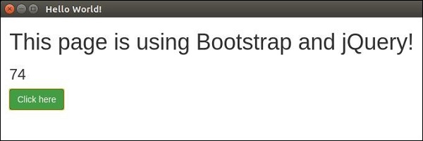

# Intro to Electron

## Learning Competencies
At the end of this topic, you will be able to understand about

- what is electron
- why we use electron
- Installation and setup electron environment
- how electron works
- how to build desktop applications using electron
- building UI's in electron

## Overview

## What is Electron

Electron is an open source library developed by GitHub for building cross-platform desktop applications with HTML, CSS, and JavaScript. Electron accomplishes this by combining Chromium and Node.js into a single runtime and apps can be packaged for Mac, Windows, and Linux.

## Why Electron?

Electron enables you to create desktop applications with pure JavaScript by providing a runtime with rich native (operating system) APIs.

This doesn’t mean Electron is a JavaScript binding to graphical user interface (GUI) libraries. Instead, Electron uses web pages as its GUI, so you could also see it as a minimal Chromium browser, controlled by JavaScript. So all the electron apps are technically web pages running in a browser that can leverage your OS APIs.

## Electron setup

To get started with developing using the Electron, you need to have Node and npm(node package manager) installed. If you don’t already have these, head over to node setup to install node on your local system. Confirm that node and npm are installed by running the following commands in your terminal.

```
node --version
npm --version
```

You should get the similar output:

```
v6.9.1
3.10.8
```


Whenever we create a project using npm, we need to provide a package.json file, which has all the details about our project. npm make it easy for us to set up this file. Let us set up our development project.

1. Fire up your terminal/cmd, create a new folder named `hello-world` and `cd` into it.

2. Now to create the package.json file using npm, use the following.

```
npm init
```

3. Now run the following command to install Electron globally.

```
$ npm install -g electron-prebuilt
```

Once it executes you can check if electron installed correctly by running:

```
$ electron --version
```

You should get the similar output:

```
v1.4.13
```

## How Electron Works?

Electron takes a main file defined in your package.json file and executes it. This main file creates application windows which contain rendered web pages and interaction with the native GUI (graphical user interface) of your operating system.

As you start an application using Electron, a main process is created. This main process is responsible for interacting with the native GUI of the operating system. It creates the GUI of your application.

Just starting the main process doesn’t give the users of your application any application window. These are created by the main process in the main file by using the BrowserWindow module. Each browser window then runs its own renderer process. The renderer process takes an HTML file which references the usual CSS files, JavaScript files, images, etc. and renders it in the window.

The main process can access the native GUI through a modules available directly in Electron. The desktop application can access all Node modules like the file system module for handling files, request to make HTTP calls, etc.

### Difference between Main and Renderer processes

The main process creates web pages by creating BrowserWindow instances. Each BrowserWindow instance runs the web page in its own renderer process. When a BrowserWindow instance is destroyed, the corresponding renderer process is also terminated.

The main process manages all web pages and their corresponding renderer processes. Each renderer process is isolated and only cares about the web page running in it.

## Hello world desktop aplication using electron

We have created a package.json file for our project, Now we'll create our first desktop app using electron.

Create a new file called `main.js`. Enter the following code in it:

```js
const {app, BrowserWindow} = require('electron')
const url = require('url')
const path = require('path')

let win

function createWindow() {
   win = new BrowserWindow({width: 800, height: 600})
   win.loadURL(url.format({
      pathname: path.join(__dirname, 'index.html'),
      protocol: 'file:',
      slashes: true
   }))
}

app.on('ready', createWindow)
```

Create another file, this time an HTML file called index.html. Enter the following code in it.

```html
<!DOCTYPE html>
<html>
   <head>
      <meta charset="UTF-8">
      <title>Hello World!</title>
   </head>
   <body>
      <h1>Hello World!</h1>
      We are using node <script>document.write(process.versions.node)</script>,
      Chrome <script>document.write(process.versions.chrome)</script>,
      and Electron <script>document.write(process.versions.electron)</script>.
   </body>
</html>
```

Run this app using the following command:

```
$ electron ./main.js
```

A new window will open up. It'll look like the following:


## How does this App Work?

We created a main file and a html file. The main file uses 2 modules `app` and `BrowserWindow`. The `app` module is used to control your application’s event lifecycle while the `BrowserWindow` module is used to create and control browser windows.

We defined a createWindow function where we are creating a new `BrowserWindow` and attaching a URL to this `BrowserWindow`. This is the HTML file that is rendered and shown to us when we run the `app`.

Note that we also used a native electron object here called process in our html file. This object is extended from the Node.js `process` object and includes all of its functionalities while adding many more.

## Building UI's

The User Interface of Electron apps is built using HTML, CSS and JS. So we can leverage all the available tools for front end web development here as well. You can use the tools like Angular, Backbone, React, etc as well as Bootstrap, Foundation, etc to build the apps.

You can use Bower to manage these frontend dependencies. Install bower using:

```
$ npm install -g bower
```

Now you can get all the available JS and CSS frameworks, libraries, plugins, etc using bower. For example, to get the latest stable version of bootstrap, just enter:

```
$ bower install bootstrap
```

This will download bootstrap in bower_components. Now you can reference this library in your HTML. Let's create a simple page using these libraries.

Now lets install jquery using npm:

```
$ npm install --save jquery
```

This can now be required in our view.js file.

We already have a main.js setup as follows:

```js
const {app, BrowserWindow} = require('electron')
const url = require('url')
const path = require('path')

let win

function createWindow() {
   win = new BrowserWindow({width: 800, height: 600})
   win.loadURL(url.format({
      pathname: path.join(__dirname, 'index.html'),
      protocol: 'file:',
      slashes: true
   }))
}

app.on('ready', createWindow)
```

Open your `index.html` file and enter the following code in it:

```html
<!DOCTYPE html>
<html>
   <head>
      <meta charset="UTF-8">
      <title>Hello World!</title>
      <link rel="stylesheet" href="./bower_components/bootstrap/dist/css/bootstrap.min.css" />
   </head>
   <body>
      <div class="container">
         <h1>This page is using Bootstrap and jQuery!</h1>
         <h3 id="click-counter"></h3>
         <button class="btn btn-success" id="countbtn">Click here</button>
         <script src="./view.js" ></script>
      </div>
   </body>
</html>
```

Create view.js and enter the click counter logic in it:

```js
let $ = require('jquery')  // jQuery now loaded and assigned to $
let count = 0
$('#click-counter').text(count.toString())
$('#countbtn').on('click', () => {
   count ++
   $('#click-counter').text(count)
})
```

Run the app using:

```
$ electron ./main.js
```

You should get the output:



You can build your native app just like you build websites. If you dont want users to be restricted to an exact window size, you can leverage responsive design and allow users to use your app in a flexible manner.

## Exploration
 - Official documentation of [electron](https://electronjs.org/docs)
 - watch [this](https://www.youtube.com/watch?v=kN1Czs0m1SU&t) to understand more about electron
 - Build your first [electron application](https://medium.freecodecamp.org/how-to-build-your-first-app-with-electron-41ebdb796930)
